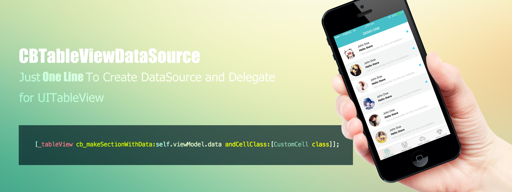
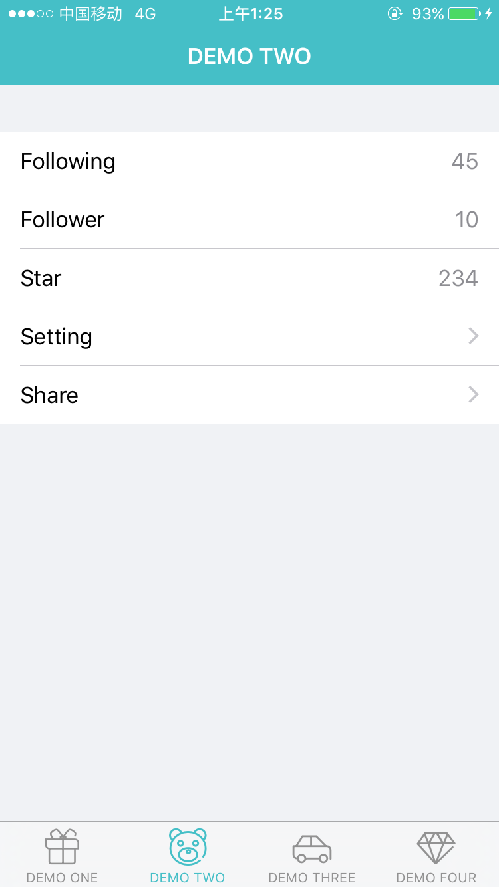
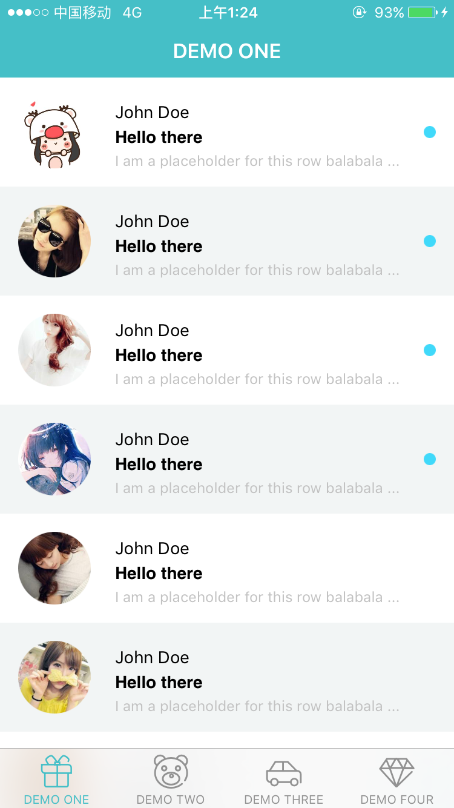

# CBTableViewDataSource


Just one line to create `DataSource` and `Delegate` for `UITableView`.
 [中文文档 (Document in Chinese)](https://github.com/cocbin/CBTableViewDataSource/blob/master/README_ZH.md)

## Introduction

`CBTableViewDataSource` is a lightweight Framework which was used to create `DataSource` and `Delegate` for `UITableView` quickly. It provides a simple API to create logical and easily maintained code.

The most lazy way to create `DataSource` like this:

``` objective-c
[_tableView cb_makeSectionWithData:self.viewModel.data andCellClass:[CustomCell class]];
```

Of course, you must follow some convention in this way. At the same time, I also provides others flexible way to create `DataSource`.

Details as document below.

## Why use

We always spend a lot of time and energy to create `DataSource` and `Delegate` for `UITableView` when we develop an App. While those code tend to repetitive and hard maintenance, because them located in each position of each delegate method.  We must found them from corner to corner, and modified them when we maintain program.

However, `CBTableViewDataSource` changed all this, and provides a simple API to help us create logical and easily maintained code.

In order to make everyone noticed advantage of this framework, let's do a compare.

Native way below:

``` objective-c

// Native vision

// define a enum to split section

typedef NS_ENUM(NSInteger, SectionNameDefine) {
    SECTION_ONE,
    SECTION_TWO,
    SECTION_THREE,
    SECTION_FOUR,
    //...
    COUNT_OF_STORE_SECTION
};

// define identifier for section

#define IDENTIFIER_ONE  @"IDENTIFIER_ONE"
#define IDENTIFIER_TWO  @"IDENTIFIER_TWO"
#define IDENTIFIER_THREE  @"IDENTIFIER_THREE"
#define IDENTIFIER_FOUR @"IDENTIFIER_FOUR"
//...


// register cell class for section

[self.tableView registerClass:[OneCell class] forCellWithReuseIdentifier:IDENTIFIER_ONE];
[self.tableView registerClass:[TwoCell class] forCellWithReuseIdentifier:IDENTIFIER_TWO];
[self.tableView registerClass:[ThreeCell class] forCellWithReuseIdentifier:IDENTIFIER_THREE];
[self.tableView registerClass:[FourCell class] forCellWithReuseIdentifier:IDENTIFIER_FOUR];


// implementation datasource protocol

- (NSInteger)numberOfSectionsInTableView:(UITableView *)tableView {
    return COUNT_OF_STORE_SECTION;
}

- (NSInteger)tableView:(UITableView *)tableView numberOfRowsInSection:(NSInteger)section {
    return ((NSArray*)self.data[section]).count;
}

- (UITableViewCell *)tableView:(UITableView *)tableView cellForRowAtIndexPath:(NSIndexPath *)indexPath {
    NSUInteger section = (NSUInteger) indexPath.section;
    NSUInteger index = (NSUInteger) indexPath.row;
    switch(section) {
        case SECTION_ONE:
        // to do something
            return cell;
        case SECTION_TWO:
        // to do something
            return cell;
        case SECTION_THREE:
        // to do something
            return cell;
            
            //...
    }
    
    return cell;
}
// ...

```

It is cumbersome and hard maintenance in this way. 

While using `CBTableViewDataSource`:

``` objective-c
[_tableView cb_makeDataSource:^(CBTableViewDataSourceMaker * make) {
    // section one
    [make makeSection:^(CBTableViewSectionMaker *section) {
        section.cell([OneCell class])
            .data(self.viewModel.oneDate)
            .adapter(^(OneCell * cell,id data,NSUInteger index){
                [cell configure:data];
            })
            .autoHeight();
    }];
    // section two
    [make makeSection:^(CBTableViewSectionMaker *section) {
        section.cell([TwoCell class])
            .data(self.viewModel.twoData)
            .adapter(^(FeedCell * cell,id data,NSUInteger index){
                [cell configure:data];
            })
            .autoHeight();
    }];

    // ... so on    
}];
```

It has been concise and layered. Most important is that it make codes accord with the man's thought better.

## Usage
### Install

using `cocoapods`：

``` ruby
pod 'CBTableViewDataSource'
```

### Import

``` objective-c
#import <CBTableViewDataSource/CBTableViewDataSource.h>
```

### Create `DataSource` and `Delegate`

``` objective-c
[_tableView cb_makeDataSource:^(CBTableViewDataSourceMaker * make) {
    // section one
    [make makeSection:^(CBTableViewSectionMaker *section) {
        section.cell([OneCell class])
            .data(self.viewModel.oneDate)
            .adapter(^(OneCell * cell,id data,NSUInteger index){
                [cell configure:data];
            })
            .autoHeight();
    }];
    // section two
    [make makeSection:^(CBTableViewSectionMaker *section) {
        section.cell([TwoCell class])
            .data(self.viewModel.twoData)
            .adapter(^(FeedCell * cell,id data,NSUInteger index){
                [cell configure:data];
            })
            .autoHeight();
    }];

    // ... so on    
}];
```

## Example

### Just using data

``` objective-c
UITableView tableView = [UITableView new];
[tableView cb_makeSectionWithData:data];
```

It will use default `UITalbeViewCell` as Cell Class in this way.

The data must follow convention as follows：

1. data is a NSArray (NSArray < NSDictionary * >*).
2. The key of dictionary as follows:
    - `text`                use to set text for `UITableViewCell`'s textLabel
    - `detail`              use to set text for `UITableViewCell`'s detailTextLabel
    - `value`               use to set text for `UITableViewCell`'s detailTextLabel
    - `image`               use to set image for `UITableViewCell`'s imageView
    - `accessoryType`       use to set accessory type for `UITableViewCell`

    `value` and `detail` both be use to set text for `UITableViewCell`'s detailTextLabel. If use `detail` as key, the `detailTextLabel` will show at the bottom of `textLabel`. If use `value` as key, the `detailTextLabel` will show at the right of `textLabel`. They cannot do both，and the first appear in array priority.

For example：

``` objective-c
_data = @[
    @{@"text":@"Following",@"value":@"45"},
    @{@"text":@"Follower",@"value":@"10"},
    @{@"text":@"Star",@"value":@"234"},
    @{@"text":@"Setting",@"accessoryType":@(UITableViewCellAccessoryDisclosureIndicator)},
    @{@"text":@"Share",@"accessoryType":@(UITableViewCellAccessoryDisclosureIndicator)}];
```

UI as follows:



Check detail on file named `DemoTwoViewController.h` and `DemoTwoViewController.m`.

### Using custom cell

``` objective-c
[tableView cb_makeSectionWithData:data andCellClass:[CustomCell class]];
```

`CustomCell` must provides a `Configuer:` method or `Configuer:index:` method to adapt data.

For example:

``` objective-c
- (void)configure:(NSDictionary *)row index:(NSNumber * )index {
    if (row[@"avatar"]) {
        [self.avatarView setImage:[UIImage imageNamed:row[@"avatar"]]];
    } else {
        [self.avatarView setImage:nil];
    }
    [self.nameLabel setText:row[@"name"]];
    [self.titleLabel setText:row[@"title"]];
    [self.detailLabel setText:row[@"detail"]];
    self.circleView.hidden = row[@"unread"] == nil;

    if([index intValue] &1) {
        self.contentView.backgroundColor = [UIColor colorWithRed:0.95 green:0.96 blue:0.96 alpha:1.00];
    } else {
        self.contentView.backgroundColor = [UIColor whiteColor];
    }
}
```
Check detail on file named `CustomCell.h` and `CustomCell.m`

UI as follows:


Check detail on file named `DemoOneViewController.h` and `DemoOneViewController.m`.

### More flexible setting

``` objective-c
[tableView cb_makeSection:^(CBTableViewSectionMaker * section) {
	section.data(@[]);
	section.cell([CustomCell class]);
	section.adapter(^(CustomCell cell,id row,NSUInteger index) {
		cell.configure(row);
	});
	section.event(^() {
		// do something
	})
	// other setting
}];
```

Here show the case of single section.

#### CBTableViewSectionMaker

`CBTableViewSectionMaker` was used to setting some attribute for section. 
Available attribute as follows :

##### data 

Setting the data be used show in `UITableView`,argument was required a NSArray.

For example:

``` objective-c
section.data(@[@(goods1),@(goods2),...]);
```

##### cell

Setting the `Cell Class` which was used to show data.
The identifier of cell will be register automatically.

For example:

``` objective-c
section.cell([CustomCell class]);
```

##### adapter

Was used to adapt cell and date.

For example:

``` objection-c
section.adapter(^(CustomCell * cell,id row,NSUInteger index) {
    [cell configure:row];
    // ...
});
```

##### event

Was used to setting event when cell be touch, for example:

``` objective-c
section.event(^(NSUInteger index,id row) {
    CustomViewController * controller = [CustomViewController new];
    controller.viewModel.data = row;
    [self.navigationController pushViewController:controller animated:YES];
});
```

##### height

Used to setting height for `cell`. Is required a static value.
This height just vail for current section.

``` objective-c
section.height(100);
```

##### autoHeight

Used to setting dynamic calculate height for cell.

``` objective-c
section.autoHeight();
```

If has setting `autoHeight`,the `height` will be invalid.

##### headerTitle;

Used to setting header title for section. For example:

``` objective-c
section.headerTitle("title");
```

##### footerTitle;

Used to setting footer title for section. ditto.

##### headerView;

Used to setting header view for section. For example

``` objective-c
section.headerView(^(){
    UIView * headerView = [UIView alloc]initWithFrame:CGRectMake(0,0,320,40);
    // ...
    return headerView;
})
```

If has setting `headerView`,`headerTitle` will be invalid.

##### footerView;

Used to setting footer view for section. ditto.

###  Multiple Section

``` objective-c
[tableView cb_makeDataSource:^(CBTableViewDataSourceMaker * make) {
	[make headerView:^{
		return [HeaderView new];
	}];
	[make makeSection: ^(CBTableViewSectionMaker * section) {
		section.data(@[]);
		section.cell();
		section.adapter();
		section.event();
		// ... so on
	}];
	[make makeSection: ^(CBTableViewSectionMaker * section) {
		section.data(@[]);
		section.cell();
		section.adapter();
		section.event();
		// ... so on
	}];
	[make makeSection: ^(CBTableViewSectionMaker * section) {
		section.data(@[]);
		section.cell();
		section.adapter();
		section.event();
		// ... so on
	}];
	// .. so on
	[make footView:^{
		return [FooterView new];
	}];
}]
```

UI as follows:


Check detail on file named `DemoThreeViewController.h` and `DemoThreeViewController.m`.

#### CBTableViewDataSourceMaker
`CBTableViewDataSourceMaker` was used to setting some attribute for `UITableView`. 
Available attribute as follows :

##### makeSection
Used to add a section for `UITableView`.For example:

``` objective-c
[tableView cb_makeDataSource:^(CBTableViewDataSourceMaker * make) {
	[make makeSection: ^(CBTableViewSectionMaker * section) {
	   // ...
	}
}]
```

##### height
Used to setting default height for `UITableView`

``` objective-c
make.height(100);
```

If you had setting `height` or `autoHeight` for section, the `height` of here will invalid. Default is 40.

##### headerView
Used to setting tableHeaderView for `UITableView`.Notice the difference between `tableHeaderView` and section‘s `headerView`. 

For example:

``` objective-c
make.headerView(^(){
    UIView * headerView = [[UIView alloc]init];
    // ...
    return headerView;
});
```

##### footerView
Used to setting tableFooterView for `UITableView`. ditto.

##### commitEditing
Used to setting `commitEditing` method for `UITableViewDelegate`.

``` objective-c
 [make commitEditing:^(UITableView * tableView, UITableViewCellEditingStyle * editingStyle, NSIndexPath * indexPath) {
    // do somethings.                
}];
```

##### scrollViewDidScroll
Used to setting `scrollViewDidScroll` method for `UITableViewDelegate`

````objective-c
[make scrollViewDidScroll:^(UIScrollView * scrollView) {
    // do somethings                
}];
````

## Thinks

Thank you for using and supporting. Welcome to issue and pull request. I will deal  with at first time.

I refer to many master in this framework. For example, I refer to famous `autolayout` framework `Masonary` when I design API. The way to dynamic calculate cell height is refer to `@forkingdog`'s `UITableView-FDTemplateLayoutCell`.

Thinks them for bring inspiration to me.

Contact me by email :460469837@qq.com


